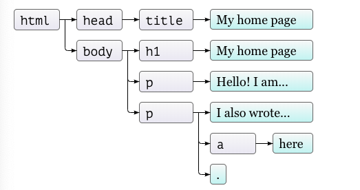
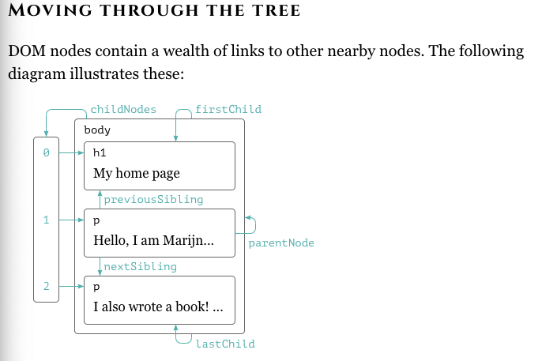
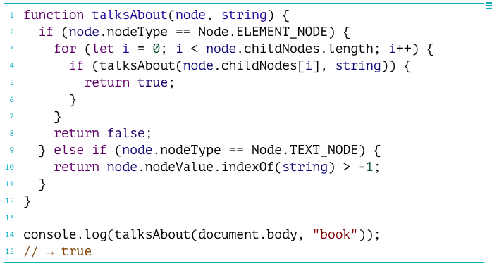
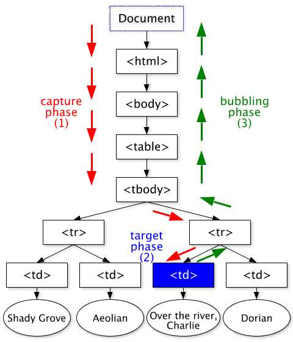

## DOM

When you open a web page in your browser, the browser retrieves the page’s HTML text and parses it. **The browser builds up a model of the document’s structure and uses this model to draw the page on the screen. This representation of the document is one of the toys that a JavaScript program has available in its sandbox**. It is a data structure that you can read or modify. It acts as a live data structure: when it’s modified, the page on the screen is updated to reflect the changes. This representation is called the `Document Object Model`, or DOM for short.

**DOM is of Tree Data structure**. Trees come up a lot in computer science. In addition to representing recursive structures such as HTML documents or programs, they are often used to maintain sorted sets of data because elements can usually be found or inserted more efficiently in a tree than in a flat array.

Each DOM node object has a nodeType property, which contains a code (number) that identifies the type of node. Elements have code 1, which is also defined as the constant property Node.ELEMENT_NODE. Text nodes, representing a section of text in the document, get code 3 (Node.TEXT_NODE). Comments have code 8 (Node.COMMENT_NODE).



Using cryptic numeric codes to represent node types is not a very JavaScript-like thing to do. As an example of this poor integration, consider the childNodes property that element nodes in the DOM have. This property holds an array-like object, with a length property and properties labeled by numbers to access the child nodes. But it is an instance of the NodeList type, not a real array, so it does not have methods such as slice and map.



Every node has a `parentNode` property that points to the node it is part of, if any. Likewise, every element node (node type 1) has a `childNodes` property that points to an array-like object holding its children. JavaScript also gives you access to a number of additional convenience links. The `firstChild` and `lastChild` properties point to the first and last child elements or have the value null for nodes without children. Similarly, `previousSibling` and `nextSibling` point to adjacent nodes, which are nodes with the same parent that appear immediately before or after the node itself. For a first child, `previousSibling` will be null, and for a last child, `nextSibling` will be null.

There’s also the children property, which is like `childNodes` but contains only element (type 1) children, not other types of child nodes. This can be useful when you aren’t interested in text nodes.
When dealing with a nested data structure like this one, recursive functions are often useful. The following function scans a document for text nodes containing a given string and returns true when it has found one:



The nodeValue property of a text node holds the string of text that it represents.

##### Finding Elements:
```html
<p> 
	<a href=“google.com”> 
	<a id="id2" href=“yahoo.com”>
</p>
<script>
  const a = document.body.getElementsByTagName("a")[0];
  const canUseIds = document.getElementById('id2');
  const byClassNameToo = document.getElementsByClassName('.some-class')
</script>
```


##### Changing the document

Nodes have a remove method to remove them from their current parent node. To add a child node to an element node, we can use `appendChild`, which puts it at the end of the list of children, or `insertBefore`, which inserts the node given as the first argument before the node given as the second argument. The `replaceChild` method is used to replace a child node with another one. It takes as arguments two nodes: a new node and the node to be replaced. 

```javascript
document.createTextNode(“This is just a text”)
```

##### Attributes

Some element attributes, such as href for links, can be accessed through a property of the same name on the element’s DOM object. This is the case for most commonly used standard attributes.
But HTML allows you to set any attribute you want on nodes. This can be useful because it allows you to store extra information in a document. If you make up your own attribute names, though, such attributes will not be present as properties on the element’s node. Instead, you have to use the getAttribute and setAttribute methods to work with them.

##### Layout

Paragraphs `p` or headings `h1`, take up the whole width of the document and are rendered on separate lines. These are called blockelements. links `a` or the `strong` element, are rendered on the same line with their surrounding text. Such elements are called inline elements.

For any given document, browsers are able to compute a layout, which gives each element a size and position based on its type and content. 

The size and position of an element can be accessed from JavaScript. The `offsetWidth` and `offsetHeight` properties give you the space the element takes up in pixels. `clientWidth` and `clientHeight` give you the size of the space inside the element, ignoring border width.
```html 
<p style="border: 3px solid red">
  Im boxed in
</p>
  ```

```javascript
let para = document.body.getElementsByTagName("p")[0];
para.clientHeight = 18
para.offsetHeight = 24 //(18+ border-top: 3px  + border-bottom: 3px)
  ```


The most effective way to find the precise position of an element on the screen is the `getBoundingClientRect` method.  It returns an object with `top`, `bottom`, `left`, and `right` properties, indicating the pixel positions of the sides of the element relative to the top left of the screen. If you want them relative to the whole document, you must add the current scroll position, which you can find in the `pageXOffset` and `pageYOffset` bindings. 

##### CSS
```css
/* p elements with id main and with classes a and b */
p#main.a.b {
  margin-bottom: 20px;
}
```
The precedence rule favoring the most recently defined rule applies only when the rules have the same specificity. A rule’s specificity is a measure of how precisely it describes matching elements, determined by the number and kind (tag, class, or ID) of element aspects it requires. For example, a rule that targets `p.a` is more specific than rules that target `p` or just `.a` and would thus take precedence over them.
The notation `p > a {…}` applies the given styles to all <a> tags that are direct children of <p> tags. Similarly, `p a {…}` applies to all <a> tags inside <p>tags, whether they are direct or indirect children.

##### Query Selectors

The querySelectorAll method, which is defined both on the document object and on element nodes, takes a selector string and returns a NodeList containing all the elements that it matches.

```html
<p>And if you go chasing
  <span class="animal">rabbits</span></p>
<p>And you know you're going to fall</p>
<p>Tell 'em a <span class="character">hookah smoking
  <span class="animal">caterpillar</span></span></p>
<p>Has given you the call</p>

<script>
  function count(selector) {
    return document.querySelectorAll(selector).length;
  }
  console.log(count("p"));           // All <p> elements
  // → 4
  console.log(count(".animal"));     // Class animal
  // → 2

</script>
```


Unlike methods such as `getElementsByTagName`, the object returned by `querySelectorAll` is not live. It won’t change when you change the document. It is still not a real array, though, so you still need to call `Array.from` if you want to treat it like one.

**Positioning and Animating**
The position style property influences layout in a powerful way. By default it has a value of `static`, meaning the element sits in its normal place in the document. 
  - When it is set to `relative`, the element still takes up space in the document, but now the top and left style properties can be used to move it relative to that normal place. 
  - When position is set to `absolute`, the element is removed from the normal document flow—that is, it no longer takes up space and may overlap with other elements. Also, its top and left properties can be used to absolutely position it relative to the top-left corner of the nearest enclosing element whose position property isn’t static, or relative to the document if no such enclosing element exists.


#### CHAPTER 15 EVENTS
```html
<button>Click me</button>
<p>No handler here.</p>
<script>
  let button = document.querySelector("button");
  button.addEventListener("click", () => {
    console.log("Button clicked.");
  });
</script>
  ```
That example attaches a handler to the button node. Clicks on the button cause that handler to run, but clicks on the rest of the document do not.
The `removeEventListener` method, called with arguments similar to `addEventListener`, removes a handler.
```html
<button>Act-once button</button>
<script>
  let button = document.querySelector("button");
  function once() {
    console.log("Done.");
    button.removeEventListener("click", once);
  }
  button.addEventListener("click", once);
</script>
  ```

The function given to `removeEventListener` has to be the same function value that was given to `addEventListener`. So, to unregister a handler, you’ll want to give the function a name (once, in the example) to be able to pass the same function value to both methods.

**stopPropagation**
 If a button inside a paragraph is clicked, event handlers on the paragraph will also see the click event.  The event is said to propagate outward, from the node where it happened to that node’s parent node and on to the root of the document.  At any point, an event handler can call the `stopPropagation` method on the event object to prevent handlers further up from receiving the event. Most event objects have a target property that refers to the node where they originated. 

It is also possible to use the target property to cast a wide net for a specific type of event. For example, if you have a node containing a long list of buttons, it may be more convenient to register a single click handler on the outer node and have it use the target property to figure out whether a button was clicked, rather than register individual handlers on all of the buttons.

```html
<button>A</button>
<button>B</button>
<button>C</button>
<script>
  document.body.addEventListener("click", event => {
    if (event.target.nodeName == "BUTTON") {
      console.log("Clicked", event.target.textContent);
    }
  });
</script>
  ```  
Many events have a default action associated with them. If you click a link, you will be taken to the link’s target. If you press the down arrow, the browser will scroll the page down. If you right-click, you’ll get a context menu. And so on.
For most types of events, the JavaScript event handlers are called before the default behavior takes place. If the handler doesn’t want this normal behavior to happen, typically because it has already taken care of handling the event, it can call the preventDefault method on the event object.

When we `addEventListener` on a node, we can give additional attributes to it like `once : true`, or `capture : true`. What the `once: true` does is as soon as the event is triggered, say a button was clicked, it’s deregistered so it’s no longer being captured. 

**once: true** : 
By default, event listeners persist after the first time they're called, which is what you want for some types of events—buttons that can be clicked multiple times, for example. For other uses, though, having an event listener stick around isn't necessary, and can lead to undesirable behavior if you have a callback that must only execute once. Previously it was achieved by doing this 

```javascript
element.addEventListener('click', function cb(event) {
// ...one-time handling of the click event...
event.currentTarget.removeEventListener(event.type, cb);
});
```

#### Event Dispatch Process: 

Given the three phases of event travel:
1. **The capture phase:** the event is dispatched to the target's ancestors from the root of the tree to the direct parent of the target node.
2. **The target phase:** the event is dispatched to the target node.
3. **The bubbling phase:** the event is dispatched to the target's ancestors from the direct parent of the target node to the root of the tree.

  `useCapture` (capture: true) indicates for which phases the event travel will be on:
If true, useCapture indicates that the user wishes to add the event listener for the capture phase only, i.e. this event listener will not be triggered during the target and bubbling phases. If false, the event listener will only be triggered during the target and bubbling phases

  
  